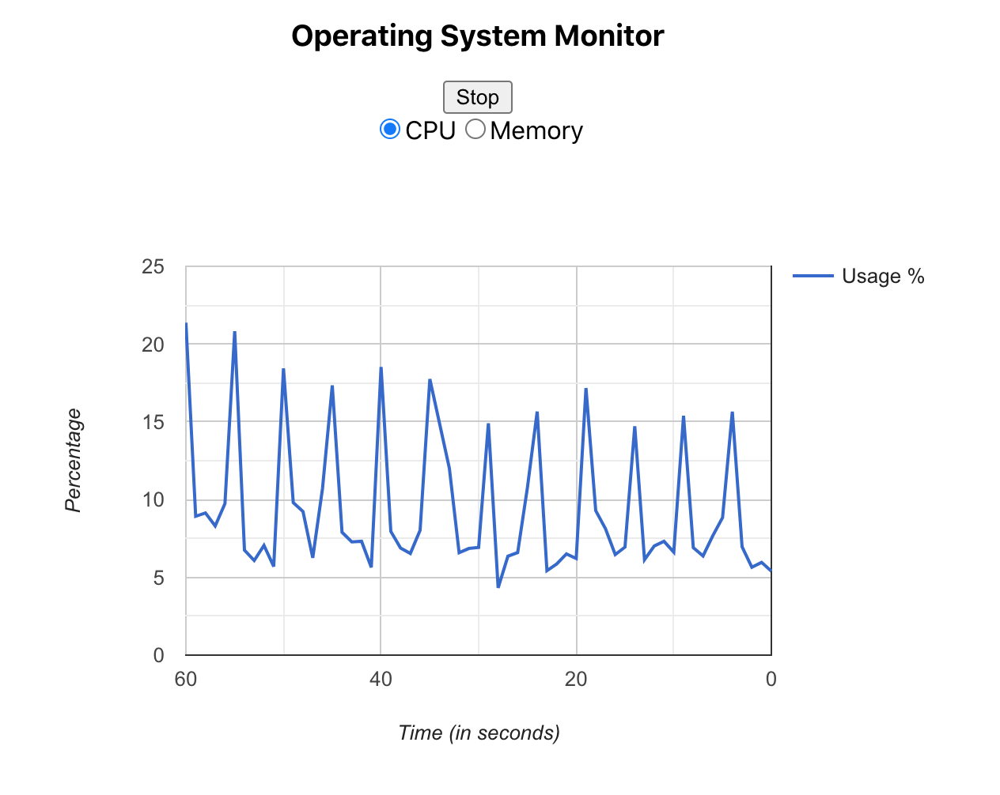

# Operating System Monitor



## Project Features
- Get server's CPU and Memory Usage
- View the usage in chart representation
- The chart is updated every 5 seconds
- Click start to start monitoring the usage
- Click stop to stop usage monitor.

## Technology Stack
- React (Frontend)
- Spring Boot (Backend)
- MongoDb (Database)

## Prerequisites
Ensure following is installed and available in your system:
- [Java 11](https://www.oracle.com/java/technologies/javase-jdk11-downloads.html)
- [Maven](https://maven.apache.org/install.html)
- [MongoDb](https://docs.mongodb.com/manual/installation/)
- [Yarn](https://classic.yarnpkg.com/en/docs/install)

## Steps to start the app:
- Clone this repository
    ```
    git clone git@github.com:shah-tejas/OperatingSystemMonitor.git
    ```
- Change directory
    ```
    cd OperatingSystemMonitor
    ```
- Start the backend service:
    - Ensure Mongodb daemon is running
    - Change Directory to `monitor-api`
        ```
        cd monitor-api
        ```
    - Start the app
        ```
        mvn spring-boot:run
        ```
    - Once ready the api will be started on `http://localhost:8080`

- Start the frontend:
    - In a new terminal Change directory to `monitor-ui`
        ```
        cd monitor-ui
        ```
    - Install yarn dependencies
        ```
        yarn install
        ```
    - Start the app
        ```
        yarn start
        ```
    - Once ready the app will be started on `http://localhost:3000/`

